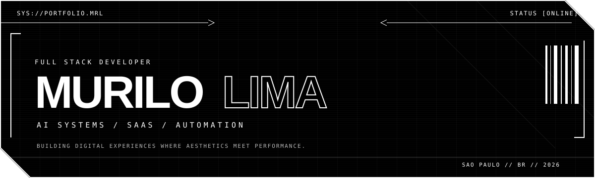

[PORTFOLIO ↗](https://github.com/MuriloROL/portfolio)　·　[LINKEDIN ↗](https://www.linkedin.com/in/devmurilolima/)　·　[GITHUB ↗](https://github.com/MuriloROL)　·　[EMAIL ↗](mailto:murilo.rl.dev@gmail.com)

---

## 01 // ABOUT

<table>
  <tr>
    <td width="27%" valign="top">
      CURRENT NODE  
      <strong>NOBUG TECNOLOGIA</strong> 
      Full Stack Developer IA  
      <code>REMOTE // BR</code>
    </td>
    <td valign="top">
      <strong>AI-FIRST PRODUCTS / MULTI-TENANT SAAS / AUTOMATION</strong>  
      I turn product discovery and business needs into reliable software, working across architecture, implementation and production deployment.  
      My work connects agents, RAG, vector search and LLM orchestration with responsive interfaces, typed APIs, databases and infrastructure.
    </td>
  </tr>
</table>

---

## 02 // CORE SYSTEMS

<table>
  <tr>
    <td width="50%" valign="top">
      SYS_01 
      <strong>AI ENGINEERING</strong>  
      AI agents · RAG · LangChain · LLM integration · Prompt engineering · Intelligent workflows
    </td>
    <td width="50%" valign="top">
      SYS_02 
      <strong>FULL STACK PRODUCTS</strong>  
      React · Next.js · TypeScript · Node.js · Python · FastAPI · REST APIs
    </td>
  </tr>
  <tr>
    <td width="50%" valign="top">
      SYS_03 
      <strong>DATA &amp; INFRASTRUCTURE</strong>  
      PostgreSQL · Supabase · pgvector · MySQL · Prisma · Docker · Vercel
    </td>
    <td width="50%" valign="top">
      SYS_04 
      <strong>PRODUCT ENGINEERING</strong>  
      Multi-tenant architecture · Client discovery · Technical decisions · End-to-end delivery
    </td>
  </tr>
</table>

---

## 03 // EXPERIENCE LOG

<table>
  <tr>
    <td width="25%" valign="top">
      <code>ACTIVE_NODE</code>  
      <strong>NOBUG TECNOLOGIA</strong> 
      AUG 2026 — PRESENT REMOTE // BRAZIL
    </td>
    <td valign="top">
      <strong>FULL STACK DEVELOPER IA</strong>  
      ↳ Build AI-first, multi-tenant SaaS products from prototype to production. 
      ↳ Translate client needs into technical solutions and delivery outcomes. 
      ↳ Own architecture, product decisions and end-to-end execution.
    </td>
  </tr>
  <tr>
    <td width="25%" valign="top">
      <code>ARCHIVE_02</code>  
      <strong>NEXIA LAB</strong> 
      MAR 2026 — AUG 2026
    </td>
    <td valign="top">
      <strong>FULL STACK DEVELOPER — AUTOMATION &amp; AI</strong>  
      ↳ LangChain agents integrated with external APIs — up to <strong>80%</strong> less manual work. 
      ↳ LLM tuning — <strong>40%</strong> better answers and <strong>30%</strong> lower token costs. 
      ↳ n8n workflows — more than <strong>15 hours/week</strong> of analysis saved.
    </td>
  </tr>
  <tr>
    <td width="25%" valign="top">
      <code>ARCHIVE_01</code>  
      <strong>A2LF SOFTWARE</strong> 
      AUG 2025 — FEB 2026 REMOTE // CANADA
    </td>
    <td valign="top">
      <strong>JUNIOR FULL STACK DEVELOPER</strong>  
      ↳ Built REST APIs with Node.js, Express, Prisma and MySQL. 
      ↳ Delivered authentication and user management in two sprints. 
      ↳ Developed responsive React interfaces and contributed through code reviews.
    </td>
  </tr>
</table>

---

## 04 // SELECTED CASE STUDIES

<table>
  <tr>
    <td width="24%" valign="top">
      CASE_01 // AI SYSTEM  
      <strong>CUSTO REAL AUTO</strong>  
      <a href="https://carros-drab.vercel.app">LIVE ↗</a> · <a href="https://github.com/MuriloROL/carros">SOURCE ↗</a>
    </td>
    <td valign="top">
      <strong>MISSION</strong> 
      AI advisor for used-car decisions. A RAG-first agent investigates chronic defects while a specialized model calculates annual ownership cost and its impact on income.  
      <strong>STACK</strong> // React · FastAPI · LangChain · OpenRouter · Supabase · pgvector
    </td>
  </tr>
  <tr>
    <td width="24%" valign="top">
      CASE_02 // FULL STACK  
      <strong>TASK MANAGER</strong>  
      <a href="https://taskmanager-two-delta.vercel.app/">LIVE ↗</a> · <a href="https://github.com/MuriloROL/taskmanager">SOURCE ↗</a>
    </td>
    <td valign="top">
      <strong>MISSION</strong> 
      Cross-platform task management with secure per-user data and a complete authenticated CRUD flow organized by category, priority and deadline.  
      <strong>STACK</strong> // React Native · Expo · Django REST Framework · JWT · Docker
    </td>
  </tr>
  <tr>
    <td width="24%" valign="top">
      CASE_03 // AI / NLP  
      <strong>EMAIL CLASSIFIER</strong>  
      <a href="https://classificador-de-emails-orpin.vercel.app">LIVE ↗</a> · <a href="https://github.com/MuriloROL/ClassificadorDeEmails">SOURCE ↗</a>
    </td>
    <td valign="top">
      <strong>MISSION</strong> 
      Zero-shot email triage with configurable categories, confidence ranking and contextual reply suggestions, designed for lightweight serverless deployment.  
      <strong>STACK</strong> // Python · Flask · OpenRouter · NLP · Vercel
    </td>
  </tr>
</table>

---

## 05 // EDUCATION

<table>
  <tr>
    <td width="25%" valign="top"><code>EDU_NODE_01</code></td>
    <td valign="top">
      <strong>BSC IN COMPUTER SCIENCE</strong> 
      UNISAGRADO · 2024 — 2027 · IN PROGRESS
    </td>
  </tr>
</table>

---

Open to conversations about AI products, Full Stack engineering and automation.

[OPEN CONTACT CHANNEL ↗](mailto:murilo.rl.dev@gmail.com)

